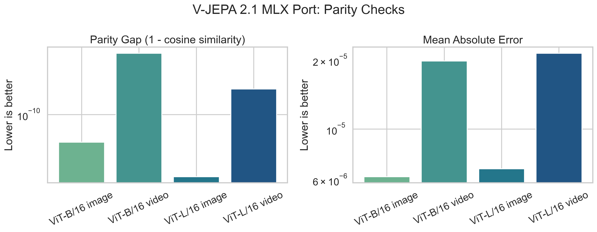
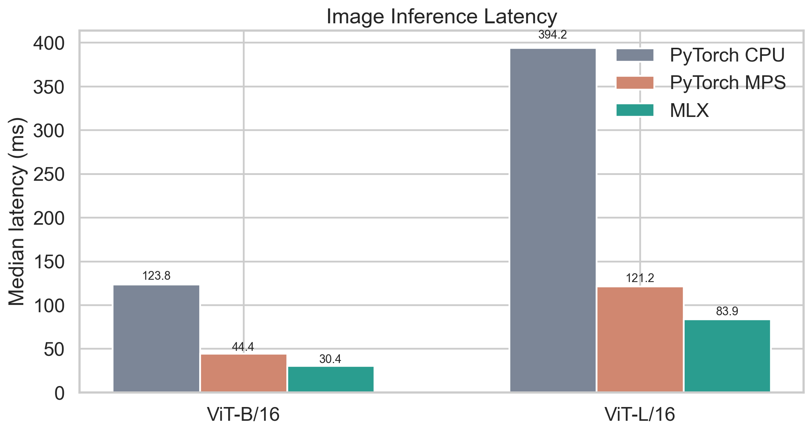
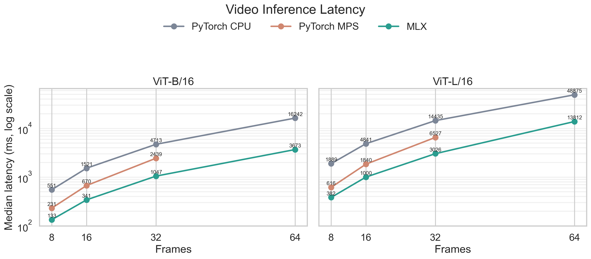

# V-JEPA 2.1 MLX

This repository is a local MLX port of the V-JEPA 2.1 encoder for Apple
silicon. It ports the public V-JEPA 2.1 base and large encoder checkpoints,
verifies the MLX outputs against the upstream PyTorch implementation, and
benchmarks PyTorch CPU, PyTorch MPS, and MLX on the same normalized inputs.

The project focuses on encoder inference, parity checks, and benchmarking. It
does not include V-JEPA pretraining, predictor training, or downstream training
recipes.

Check out the [blog post](https://www.sugarz.me/posts/porting_vjepa_to_mlx/) for more information.

## What Is Included

- MLX encoder implementations for `vjepa2_1_vit_base_384` and
  `vjepa2_1_vit_large_384`
- PyTorch reference backend that wraps the upstream `facebookresearch/vjepa2`
  encoder
- Shared image and video preprocessing
- Checkpoint download and MLX conversion helpers
- CLI commands for inference, parity checks, asset download, and benchmarking
- Tests covering checkpoint utilities, benchmarking helpers, and small-model
  parity

## Setup

Use `uv` to create the local environment and install the package:

```bash
uv sync --extra dev
```

The PyTorch reference backend imports the upstream V-JEPA 2 repository from
`references/vjepa2`. Bootstrap the pinned checkout with:

```bash
./scripts/clone_reference_vjepa2.sh
```

The generated `references/` directory is ignored by git.

## Download Checkpoints And Samples

Download the official checkpoints and sample image/video into `.artifacts/`:

```bash
uv run vjepa2-1 download-assets
```

You can also fetch a single checkpoint:

```bash
uv run vjepa2-1 download-assets --model vjepa2_1_vit_base_384
```

The `.artifacts/` directory is ignored by git. Checkpoints, converted MLX
weights, benchmark outputs, and sample media are downloaded or generated
locally rather than committed.

## Run Inference

Run MLX inference on the sample image:

```bash
uv run vjepa2-1 infer \
  --backend mlx \
  --model vjepa2_1_vit_base_384 \
  --input-path .artifacts/samples/sample_image.png \
  --input-type image
```

Run PyTorch reference inference on the sample video:

```bash
uv run vjepa2-1 infer \
  --backend pytorch \
  --model vjepa2_1_vit_base_384 \
  --input-path .artifacts/samples/sample_video.mp4 \
  --input-type video
```

## Run Parity Checks

Compare PyTorch and MLX encoder features on an image:

```bash
uv run vjepa2-1 parity \
  --model vjepa2_1_vit_base_384 \
  --input-path .artifacts/samples/sample_image.png \
  --input-type image
```

Compare PyTorch and MLX encoder features on a video:

```bash
uv run vjepa2-1 parity \
  --model vjepa2_1_vit_base_384 \
  --input-path .artifacts/samples/sample_video.mp4 \
  --input-type video
```

The parity command reports cosine similarity, max absolute error, and mean
absolute error between the two backend outputs.

## Run Benchmarks

Run an image benchmark:

```bash
uv run vjepa2-1 benchmark \
  --model vjepa2_1_vit_base_384 \
  --input-type image
```

Run a video benchmark with a specific sampled frame count:

```bash
uv run vjepa2-1 benchmark \
  --model vjepa2_1_vit_base_384 \
  --input-type video \
  --num-frames 16
```

Benchmark artifacts are written under `.artifacts/benchmarks/`.

## Results Summary

The MLX port matches the upstream PyTorch encoder closely on the tested base and
large checkpoints. All tested image and video parity runs reached cosine
similarity almost equal to 1.

Benchmarking on an Apple M1 Max showed MLX as the fastest backend across the
tested image and video cases. PyTorch MPS was consistently faster than PyTorch
CPU when it fit in memory, but PyTorch MPS failed on the 64-frame video cases
where MLX completed successfully.







## Tests

Run the test suite:

```bash
uv run pytest -q
```

## Notes

<details>
<summary>Upstream PyTorch deprecation warnings</summary>

When running the PyTorch backend, you may see deprecation warnings from the upstream Meta V-JEPA 2.1 code.

Current known warnings:

- `timm.models.layers` import deprecation
- `torch.backends.cuda.sdp_kernel()` deprecation

These warnings come from the upstream reference implementation under `references/vjepa2`, not from the MLX port itself. They do not currently indicate a correctness issue for the implemented parity workflow.

</details>

<details>
<summary>Upstream PyTorch reference repo</summary>

The `pytorch` backend imports the cloned upstream Meta repository from `references/vjepa2`.

This repo is pinned to the upstream commit:

```text
204698b45b3712590f06245fbfba32d3be539812
```

Use the bootstrap script to clone that exact commit into the expected location:

```bash
./scripts/clone_reference_vjepa2.sh
```

</details>

<details>
<summary>Colliding upstream paths</summary>

The upstream `facebookresearch/vjepa2` repository contains case-colliding paths. On the default macOS case-insensitive filesystem, these paths cannot coexist cleanly in a checkout.

That is fine for this repository because it targets the smaller base and large
V-JEPA 2.1 variants.

```text
configs/eval_2_1/vitG-384/coin.yaml
configs/eval_2_1/vitg-384/coin.yaml
configs/eval_2_1/vitG-384/diving48.yaml
configs/eval_2_1/vitg-384/diving48.yaml
configs/eval_2_1/vitG-384/ek100.yaml
configs/eval_2_1/vitg-384/ek100.yaml
configs/eval_2_1/vitG-384/in1k.yaml
configs/eval_2_1/vitg-384/in1k.yaml
configs/eval_2_1/vitG-384/jester.yaml
configs/eval_2_1/vitg-384/jester.yaml
configs/eval_2_1/vitG-384/k400.yaml
configs/eval_2_1/vitg-384/k400.yaml
configs/eval_2_1/vitG-384/ssv2.yaml
configs/eval_2_1/vitg-384/ssv2.yaml
configs/train_2_1/vitG16/cooldown-256px-64f.yaml
configs/train_2_1/vitg16/cooldown-256px-64f.yaml
configs/train_2_1/vitG16/pretrain-256px-16f.yaml
configs/train_2_1/vitg16/pretrain-256px-16f.yaml
```

</details>
